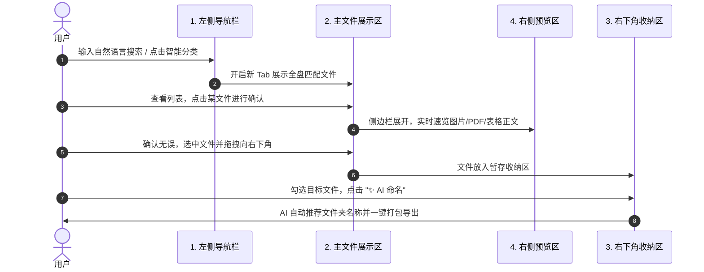

# 🚀 元宝文件管理器 (Yuanbao File Manager)
## 产品功能白皮书 & 路演汇报报告 (包含页面布局与流转闭环)

---

> **产品定位**：基于 Tauri 2.0 + Rust 原生高性能底层与 React 18 现代前端打造的**下一代 AI 智能桌面文件管理与资产检索系统**。旨在彻底解决传统操作系统（macOS Finder / Windows 资源管理器）在文件堆积混乱、搜索黑盒无序、缺乏内容感知与跨目录对比困难等痛点。

---

## 目录
- [一、 亮点功能介绍 (Feature Highlights)](#一-亮点功能介绍-feature-highlights)
  - [1. AI 智能全景聚类与动态建簇 (Smart Folder Clustering)](#1-ai-智能全景聚类与动态建簇-smart-folder-clustering)
  - [2. BM25 + 向量混合检索与匹配线索 (Hybrid Search & Match Clues)](#2-bm25--向量混合检索与匹配线索-hybrid-search--match-clues)
  - [3. 多标签页与上下双视图分屏对比 (Multi-Tab & Dual-Pane SplitView)](#3-多标签页与上下双视图分屏对比-multi-tab--dual-pane-splitview)
  - [4. AI 智能特征分析与打包命名 (AI Aggregation & Smart Naming)](#4-ai-智能特征分析与打包命名-ai-aggregation--smart-naming)
  - [5. 100% 端侧隐私安全与极致性能 (Local-First Privacy & Rust Engine)](#5-100-端侧隐私安全与极致性能-local-first-privacy--rust-engine)
- [二、 页面区域拆解与闭环流转 (UI Architecture & Workflow Closed-Loop)](#二-页面区域拆解与闭环流转-ui-architecture--workflow-closed-loop)
  - [1. 左侧导航栏 (Sidebar Area)](#1-左侧导航栏-sidebar-area)
  - [2. 主文件展示区 (Main File Workspace Area)](#2-主文件展示区-main-file-workspace-area)
  - [3. 右下角收纳区 (Staging Dropzone Area)](#3-右下角收纳区-staging-dropzone-area)
  - [4. 右侧预览区 (Side Previewer Area)](#4-右侧预览区-side-previewer-area)
  - [5. 四大区域的交互流转与闭环链路 (Complete User Workflow Closed-Loop)](#5-四大区域的交互流转与闭环链路-complete-user-workflow-closed-loop)
- [三、 整体技术架构与通俗技术映射 (Technical Architecture & Whitepaper)](#三-整体技术架构与通俗技术映射-technical-architecture--whitepaper)
  - [1. 技术对照表](#1-技术对照表)
  - [2. 混合检索与双通道重排序机制 (Search & Hybrid Reranking)](#2-混合检索与双通道重排序机制-search--hybrid-reranking)
  - [3. 智能文件夹分类的技术路径 (Smart Folder Clustering Technical Path)](#3-智能文件夹分类的技术路径-smart-folder-clustering-technical-path)
- [四、 标准路演演说讲稿 (Pitch Deck Script)](#四-标准路演演说讲稿-pitch-deck-script)

---

## 一、 亮点功能介绍 (Feature Highlights)

### 1. AI 智能全景聚类与动态建簇 (Smart Folder Clustering)
- **无需手动归类**：系统全自动扫描并分析全盘文件，将散乱的资产自动归集为格式速查入口（图片、文档、表格、媒体）与 9 大预设场景簇（`求职简历`、`合同协议`、`财务发票`、`方案报告`、`数据报表`、`设计素材`、`学习备考`、`影音媒体`、`代码工程`）。
- **自然语言 AI 动态专属建簇**：支持在智能文件夹输入框中输入任意自然语言主题（如“西财期末复习”、“股票分析数据”），系统基于全文本与 AI 描述摘要深度匹配全盘资产（≥ 1 匹配即成立），瞬间在首屏非钉住区域第一位置动态挂载专属簇卡片！
- **频次自适应沉浮**：簇卡片根据用户实际使用频次（Click Frequency）与钉住状态（Pinned First）智能升降排列。

### 2. BM25 + 向量混合检索与匹配线索 (Hybrid Search & Match Clues)
- **语义理解跨越搜索限制**：采用 BM25 文本精准匹配与 `sqlite-vec` 向量语义相似度的双通道融合算法。搜“求职”能自动关联匹配“简历.docx”，搜“报销”能自动匹配“发票.pdf”。
- **透明化匹配线索 (Match Clues)**：在搜索结果中清晰显示命中策略（`命中文件名`、`命中文档正文`、`命中图片OCR文本`、`命中语义概念`），消除传统的搜索黑盒感。

### 3. 多标签页与上下双视图分屏对比 (Multi-Tab & Dual-Pane SplitView)
- **Chrome 式多标签页管理**：支持新建 `+` 标签页、拖拽调整顺序，任何搜索操作均自动开启新标签页展示结果，完美保护原有工作上下文。
- **独立双 TabBar 上下分屏 (SplitView)**：上下半屏各自拥有**独立的自包含标签页栏**。用户可在上栏打开“最近文件”，下栏打开“下载目录”或“智能簇”，直接在两栏之间进行跨目录直观拖拽移动与对比管理。

### 4. AI 智能特征分析与打包命名 (AI Aggregation & Smart Naming)
- **随手收纳与特征提取**：随时将分散在各处的文件拖入右下角暂存收纳盘。
- **AI 一键智能打包**：调用 AI 引擎分析暂存区选中文件的公共内容特征，自动推荐精准的聚合文件夹名称（如“2026年终财务报表聚合”），并一键完成文件迁移打包。

### 5. 100% 端侧隐私安全与极致性能 (Local-First Privacy & Rust Engine)
- **全本地端侧安全**：文件解析、嵌入向量计算与 SQLite 数据库索引全在用户本地机器上完成，零数据上云。
- **Rust 毫秒级性能**：基于 Tauri 2.0 + Rust 异步驱动，内存占用较传统桌面应用降低 90%，毫秒级极速响应。

---

## 二、 页面区域拆解与闭环流转 (UI Architecture & Workflow Closed-Loop)

系统界面划分为 **4 大核心区域**，各自承担明确的职责，并通过流畅的交互形成高效闭环：

```
┌────────────────────────────────────────────────────────────────────────┐
│                        1. 顶部标签栏 (Tab Bar)                         │
├───────────────┬────────────────────────────────────────┬───────────────┤
│               │                                        │               │
│               │       2. 主文件展示区 (Main Workspace)   │               │
│               │       - 格式速查 / AI 动态建簇 Bar      │  4. 右侧预览区 │
│  1. 左侧导航栏 │       - 包含 1 行整合表头工具栏         │ (Side Preview)│
│   (Sidebar)   │       - 文件列表 / 网格展示            │               │
│               │                                        │  - 像素级速览 │
│               │                                        │  - OCR & 文本 │
│               │                                        │               │
├───────────────┴────────────────────────────────────────┴───────────────┤
│                        3. 右下角悬浮收纳区 (Staging Dropzone)          │
└────────────────────────────────────────────────────────────────────────┘
```

### 1. 左侧导航栏 (Sidebar Area)
- **区域定位**：系统的**全局控制中心**与**主导航枢纽**。
- **核心组件与功能**：
  - **顶部全局控制**：“元宝文件”系统标题，以及在下方收纳的 **`⚡️ 同步向量`** 与 **`切换工作区`** 全盘控制按钮；
  - **全局搜索框 (SmartSearchBox)**：集成 `全部` 分类下拉筛选与自然语言输入，随时触发全局搜索并开启新 Tab；
  - **快捷访问菜单**：预设 `最近文件`、`下载`、`桌面`、`微信文件`、`QQ文件`、`此电脑` 等常用目录导航；
  - **智能文件夹集合**：提供 `智能文件夹` 全景总入口，以及一键跳转 `求职简历`、`合同协议`、`财务发票` 等语义分类；
  - **标签颜色过滤**：`橙色`、`绿色`、`红色` 等多色标记快捷抽查入口，且支持将颜色 Pill 拖拽赋值给文件。

### 2. 主文件展示区 (Main File Workspace Area)
- **区域定位**：资产发现、检索展示与表格交互的**核心展示舞台**。
- **核心组件与功能**：
  - **顶部多 TabBar 栏**：支持多标签页管理，右侧放置单视图 / 上下双视图 (SplitView) 模式切换开关；
  - **AI 动态建簇输入 Bar (智能文件夹视图)**：高度压缩至 36px，支持输入自然语言动态生成专属簇并呈现渐变 Toast 提示；
  - **格式速查胶囊**：图片资产、文档资料、表格数据、媒体资产快捷筛选组件；
  - **合并型单行星列头工具栏 (Combined Toolbar & Header Row)**：
    - 将表格列头（`文件名`、`大小`、`格式`、`操作时间`）与选中文件的操作工具（`定位`、`导出 (N)`、`✨ AI 命名`）高度融合成 1 行，释放最大屏效；
  - **规范化文件列表**：16x16px 规范复选框、格式化文件大小展示（如 `47.5 MB`）、多色标签 Pill 渲染、支持全列升降序与拖拽源触发。

### 3. 右下角收纳区 (Staging Dropzone Area)
- **区域定位**：跨目录资产收集与批量整理的**暂存转换中枢**。
- **核心组件与功能**：
  - **悬浮折叠 / 平滑展开**：平时以精致气泡悬浮在右下角，拖入文件时平滑展开面板；
  - **多选与全选控制**：暂存区每个卡片内置复选框，顶部提供“全选”开关。未勾选文件时，导出和打包按钮自动置灰防护；
  - **导出与 AI 打包**：
    - `导出至本地`：将勾选的文件批量导出至用户指定的目标文件夹；
    - `✨ AI 命名打包`：调用 AI 分析选中文件的共同语义特征，推荐聚合文件夹名称，一键创建目录并将文件迁移入内。

### 4. 右侧预览区 (Side Previewer Area)
- **区域定位**：文件内容快速确权与深度抽查的**内容速览窗口**。
- **核心组件与功能**：
  - **多格式原生渲染**：在不启动外部第三方软件的情况下，直接在侧边栏速览：
    - **图片**：高清大图缩放预览；
    - **PDF**：多页翻页阅读与缩略图；
    - **文档 / 代码**：纯文本、Markdown 及代码语法高亮速览；
    - **表格数据**：Excel / CSV 电子表格的表格化结构呈现；
  - **信息摘要与标签管理**：显示文件元数据、路径，并支持在预览面板中直接修改虚拟命名与添加标签。

---

### 5. 四大区域的交互流转与闭环链路 (Complete User Workflow Closed-Loop)

系统通过巧妙的区域联动，构筑了**从资产发现到整理归档的极速闭环链路**：



#### 闭环链路 4 步走：
1. **第一步：发现与唤起 (Discover)**
   - 用户在 **【左侧导航栏】** 中点击智能分类或在搜索框输入自然语言，**【主文件展示区】** 自动新建标签页展示精准资产。
2. **第二步：确认与预览 (Verify)**
   - 用户在 **【主文件展示区】** 中点击目标文件，**【右侧预览区】** 瞬间展开，用户无需打开第三方应用即可查阅 PDF 正文或表格数据完成内容确权。
3. **第三步：收集与暂存 (Collect)**
   - 确认无误后，用户将 **【主展示区】** 中的文件直接拖拽至 **【右下角收纳区】** 暂存。暂存区支持跨多个目录连续收集资产。
4. **第四步：打包与归档 (Archive)**
   - 在 **【右下角收纳区】** 中勾选需要整理的文件，点击 `✨ AI 命名`，系统自动推断主题名称并打包导出至本地，完成文件管理的终极闭环！

---

## 三、 整体技术架构与通俗技术映射 (Technical Architecture & Whitepaper)

### 1. 技术对照表

为方便向非技术背景的团队成员、评委或客户清晰解释，下表将**软件的具体功能位置**与**底层采用的技术手段**进行了白话对照解释：

| 软件功能与界面位置 | 采用的技术手段 (Tech Stack) | 通俗原理解释（小白秒懂版） |
| :--- | :--- | :--- |
| **整体软件外壳与界面外观**<br>*(窗口、按钮、多 Tab 标签)* | **React 18 + Tauri 2.0 (Rust 语言驱动)** | **“高颜值的皮肤 + 强悍的引擎”**<br>用写网页的 React 做出极其精致流畅的界面，用底层的 Rust 做软件心脏。比传统的 Electron 桌面软件省内存 90%，毫秒级秒开，绝不卡顿！ |
| **搜索框：智能语义检索**<br>*(搜“求职”能查到“简历.docx”)* | **BM25 全文算法 + `sqlite-vec` 向量余弦检索 + RRF 混合重排序** | **“不光找字面关键字，更能读懂真实意思（三步走极速检索）”**<br>① **第一步（后台建库）**：软件在后台默默把全盘文件的正文和标题翻译成 AI 向量存入本地 SQLite 数据库；<br>② **第二步（双通道并行搜）**：你搜“求职”时，一边精确搜含“求职”字面的文件，一边用 AI 向量搜意思相近的文件（如“简历.docx”）；<br>③ **第三步（智能混合排序）**：采用 RRF 算法把精准字面命中的排最前，语义高度相关的紧随其后，兼顾精确度与智能化！ |
| **智能文件夹全景聚类**<br>*(9 大主题簇 + 动态建簇)* | **SQLite3 数据库多维索引 + Rust 异步分析** | **“全盘资产的秒级分拣机”**<br>后端用 Rust 编写了极速查询规则，几万个文件在 0.01 秒内按格式、主题全自动打标签归类，还能根据你的使用频次让常用文件夹自动靠前沉浮。 |
| **右侧预览区：原生速览**<br>*(图片/PDF/Excel/代码)* | **macOS Cocoa API + Canvas + 语法高亮引擎** | **“免安装第三方软件的超级透视图”**<br>不依赖你电脑装没装 Office 或专业渲染器，直接调用系统的底层接口，在软件内部瞬间把图片、PDF、Excel 数据渲染成高清画面。 |
| **右下角暂存区与 AI 打包**<br>*(随手收纳 + 一键打包)* | **HTML5 原生 Drag & Drop + 本地文件流** | **“随用随抓的磁吸收集箱”**<br>运用网页原生的拖拽捕捉与 Rust 高速文件流，把分散在各处的文件瞬间复制打包，并用 AI 自动分析文件特征生成规范的文件夹名字。 |
| **全盘数据隐私安全**<br>*(全本地运行)* | **Local-First (全本地端侧存储)** | **“保险箱式完全单机安全”**<br>所有文件解析、向量计算全在你的电脑本地完成，就算断网也能正常用，绝不把你的私人合同、发票或照片上传到网络云端。 |

---

### 2. 核心混合检索重排序算法 (Hybrid Search & Reranking Strategy)

对于任意检索词 $Q$，系统同时触发两条通道：
1. **精确/模糊文本通道 ($S_{text}$)**：使用 SQL `LIKE` 模糊匹配与 `FTS5` 倒排索引匹配文件名、文件路径、AI 摘要描述与标签。
2. **向量语义相似度通道 ($S_{vector}$)**：通过嵌入模型计算查询向量 $\vec{v}_Q$ 与文档向量 $\vec{v}_D$ 的余弦相似度：
   $$\text{CosineSimilarity}(\vec{v}_Q, \vec{v}_D) = \frac{\vec{v}_Q \cdot \vec{v}_D}{\|\vec{v}_Q\| \|\vec{v}_D\|}$$

3. **归一化融合得分 (Combined Score)**：
   $$\text{Score}_{\text{final}} = \alpha \cdot \text{Norm}(S_{\text{text}}) + (1 - \alpha) \cdot \text{Norm}(S_{\text{vector}})$$
   通过融合打分，确保“精确文件名”始终优先排在顶部，而“语义相关但文件名不含词”的资产跟随在后，提供兼顾精度与广度的完美搜索体验。

### 3. 智能文件夹分类的技术路径 (Smart Folder Clustering Technical Path)

智能文件夹分类从“资产提取”到“界面卡片自适应沉浮展示”，经历了 **4 步全流程链条**：

```
┌─────────────────────────────────────────────────────────────────────────────────┐
│ 1. 数据萃取层 (Data Extraction & Indexing)                                     │
│  - 扫描全盘路径，排除黑名单目录                                                 │
│  - 抽取【文件扩展名 ext】+【文件名 lower_name】+【AI摘要描述】+【多色 Tag 标签】    │
├─────────────────────────────────────────────────────────────────────────────────┤
│ 2. 多维分类聚类层 (Multi-Dimensional Clustering & Aggregation)                  │
│  - 规则通道 A (Format Grouping)：后缀扩展名比对 ➔ 生成 4 大基础格式入口         │
│  - 规则通道 B (Scenario Aggregation)：模式匹配与语义映射 ➔ 生成 9 大预设场景簇  │
│  - 规则通道 C (Dynamic AI Cluster)：自然语言多维查找 ➔ 实时生成自定义专属簇     │
├─────────────────────────────────────────────────────────────────────────────────┤
│ 3. 门槛阈值过滤层 (Threshold Gate Filter)                                        │
│  - 预设簇自动挂载门槛：匹配文件数 count ≥ 5 方可生成卡片                         │
│  - 搜索/自定义簇门槛：匹配文件数 count ≥ 1 即成立在首屏挂载                     │
├─────────────────────────────────────────────────────────────────────────────────┤
│ 4. 动态双层沉浮排序层 (Adaptive Two-Tier Floating Ranker)                        │
│  - 顶层：Pinned Layer (固定钉住区，优先按钉住顺序排列)                            │
│  - 游离层：Unpinned Floating Layer (自定义簇优先 ➔ 使用频次 Click Count 降序 ➔ 原顺序) │
└─────────────────────────────────────────────────────────────────────────────────┘
```

#### 详细技术实现拆解：
1. **数据萃取层**：通过 Rust 异步线程扫描本地磁盘，抽取每个资产文件的扩展名 `ext`、规范化文件名 `lower_name`、AI 摘要描述 `ai_suggestion` 与标签 `tags`；
2. **多维分类聚类层**：
   - **格式速查**：按 `jpg/png`、`pdf/doc`、`xls/csv` 等后缀聚合为 4 大常用入口；
   - **场景簇归集**：基于包含“简历/cv”、“合同/nda”、“发票/invoice”等关键词词库提取 9 大场景卡片；
   - **AI 动态专属建簇**：响应自然语言输入，在 `name/path/ai_suggestion/tags` 中进行全维度 SQL 模糊查找并构建独立 ID (`cluster_custom_xxx`)。
3. **门槛阈值过滤层**：系统预设簇设置 `count >= 5` 展示门槛，防止低质空壳卡片产生；自定义生成簇设置 `count >= 1` 门槛，确保用户搜索即建簇展示；
4. **动态双层沉浮排序层**：在前端 React 组件构建 `sort` 比较器，置顶钉住卡片（Pinned）排最前，新建立的 AI 专属簇紧随其后，其它卡片依据历史点击频次（Click Count）由高到低动态自适应沉浮，保障核心屏效。

---

## 四、 标准路演演说讲稿 (Pitch Deck Script)

### 🎙️ 1. 开场痛点（30秒）
> “各位朋友好！大家在日常工作中是不是经常遇到这样的烦恼：桌面堆满了几百个文件，微信里接收的文件不知道存到了哪里；想找一份之前的合同或简历，却想不起文件名叫什么，只能一个个文件夹翻找？传统的操作系统文件管理器已经几十年没有革新了。今天，我为大家介绍 **【元宝文件管理器】** —— 一款基于 Rust 引擎与 AI 大模型打造的下一代智能桌面文件管理系统！”

### 🎙️ 2. 亮点功能与四大区域介绍（1.5分钟）
> “元宝文件管理器在界面上划分为清晰的四大区域，构筑了极速的管理闭环：
> - 首先是**左侧导航栏**，集成了全局搜索与全自动的智能分类；
> - 中间是**主文件展示区**，支持像浏览器一样的多 Tab 管理与上下双视图分屏对比，上下两栏各自拥有独立 TabBar，跨目录整理文件一拉即得；
> - 右侧是**内置预览区**，图片、PDF、Excel 数据无需打开外部软件就能瞬间确权；
> - 右下角是**悬浮收纳区**，分散的文件随手拖入，一键使用 AI 智能分析特征生成文件夹名称并打包导出！”

### 🎙️ 3. 核心算法与端侧安全（1分钟）
> “在搜索方面，我们采用了 **BM25 文本 + 向量语义的混合检索算法**。你搜‘求职’，系统能自动把‘个人简历.docx’找出来，并清晰告诉你是‘命中语义概念’还是‘命中正文’。最重要的是，我们基于 Tauri 2.0 + SQLite-Vec 实现了 **100% 端侧隐私安全**，所有文件解析与向量计算完全在本地完成，内存占用降低 90%，性能极速！”

### 🎙️ 4. 总结与展望（30秒）
> “总结来说，元宝文件管理器结合了 **Rust 的极致性能**、**全端侧的隐私安全**、与 **AI 的深度感知**。它不仅仅是一个文件管理器，更是每一位知识工作者桌面上的 AI 数字资产管家。谢谢大家！”

---
*文档生成时间：2026-07-28*
