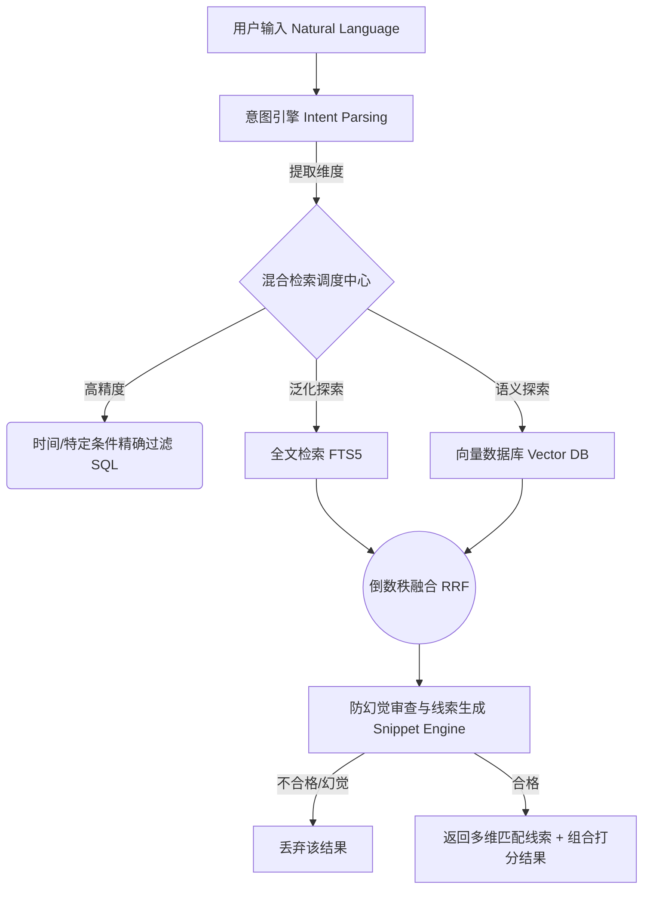

# 智能文件管理器：AI 混合检索能力白皮书与技术架构说明

> [!NOTE] 
> **文档目的**：本文档旨在向产品经理、研发工程师及相关业务方详细阐释本智能文件管理器目前的**核心检索架构、意图解析机制与匹配过滤策略**。帮助团队理解系统是如何做到“听得懂人话”、“搜得准文件”且“完美自证”的。

---

## 核心架构概览 (Architecture Overview)

本系统的搜索能力建立在 **“大模型意图解析 + 向量与全文混合检索 (Hybrid Search) + 动态防幻觉过滤”** 的三层架构之上。抛弃了传统文件管理器单纯依靠 SQL `LIKE` 模糊匹配文件名的低效方式，实现了真正的语义级查询。

---

## 第一层：意图解析引擎 (Intent Parser)

在接收到用户的自然语言 Query（如：*“帮我找一下 8 月 22 日微信里的简历”*）后，引擎首先进行特征降维和结构化提取。

系统目前支持提取以下六大核心意图维度：

1. **时间实体 (`date_target`)**：将人类语言转化为标准日期格式（例：“8月22日” -> `2026-08-22`）。
2. **文件格式 (`file_types`)**：映射后缀名与泛指（例：“Word”、“文档”、“图片”、“PDF”）。
3. **渠道与来源 (`source_path_keyword`)**：识别特定生态路径（例：“微信(wechat)”、“桌面(desktop)”、“下载(download)”）。
4. **文件体积 (`min_size_bytes`)**：识别如“大文件”、“大于10M”的容量诉求。
5. **核心语义主题 (`topic_category`)**：判定查询是否属于宏观业务类目（例：“简历”、“履历”、“CV”统一归一化为主题类目：`简历`）。
6. **分词扩展 (`search_tokens`)**：针对未落入宏观主题的长尾词汇，系统会进行同义词扩展和 N-Gram 切词。

---

## 第二层：混合检索执行器 (Hybrid Search Engine)

拿到结构化意图后，调度中心开始多路并发检索：

### 1. 绝对精准路径 (Shortcut)
如果解析出了明确的**时间意图**，系统将跳过大范围的模糊搜索，直接基于 SQLite 执行带有相关条件（如来源、格式）的时间戳硬匹配，确保“今天的文件”绝对不会搜出昨天的。

### 2. 多路并发与倒数秩融合 (RRF)
对于大部分无特定时间指向的查询，系统采用标准的混合检索：
* **FTS5 倒排索引全文检索**：极速检索文件的名称（Name）、路径（Path）、用户打上的标签（Tags）以及 AI 为文件生成的结构化摘要（AI Suggestion）。
* **向量检索 (Vector Search)**：底层采用 `BGE-M3` 向量模型，计算用户 Query 与每个文件 AI 摘要向量的余弦相似度（Cosine Similarity），从而捞出**字面毫无瓜葛但语义极度相关**的文件（例如：文件名为“西南财经大学27届”，实际是一份简历）。

两路召回的结果将通过 **RRF (Reciprocal Rank Fusion)** 算法进行平滑打分融合，计算公式如下：
`RRF_Score = 1.0 / (60.0 + FTS_Rank) + 1.0 / (60.0 + Vector_Rank)`
*(若完全命中用户的特定字面 Search Token，还会给予额外的 0.5 提权加分)*

---

## 第三层：防幻觉审查与匹配线索生成 (Strict Guard & Snippet Generation)

> [!CAUTION]
> **大模型通病（幻觉）**：向量检索很容易出现“由于相似度高而胡乱召回”的问题（例如：搜“李明”搜出“李雅浩”，因为都是人名，向量距离近）。

为了解决这一痛点并让用户体验到“搜得明白”，我们在最终输出前置入了严苛的“线索审查机制”。所有被混合检索召回的文件，**必须能自证“为什么被搜出来”**，否则将被无情抛弃。

### 线索生成与验证规则

引擎按照以下层级依次尝试从文件中提取线索。提取到的所有线索组合成一个数组返回给前端展示：

1. **完全匹配**：原文件名完整包含搜索词 `[文件名完全匹配：“...”]`
2. **主题信任**：如果是按“主题”（如简历）搜索，只要系统判定是该主题，直接信任向量召回结果 `[命中语义主题：“...”]`
3. **渠道与格式**：路径或类型命中 `[命中渠道要求：“...”]`
4. **正文高亮拦截**：精确词汇（Token）出现在 AI 摘要中，前后截取 15 个字符高亮 `[📝 正文包含：“...上下文片段...”]`
5. **无字面纯语义自证**：如果是因为向量语义召回，且没有上述具体匹配词，**系统会强制抽出该文件的 AI 摘要作为兜底线索展现** `[📝 核心内容：“文件主旨摘要...”]`

### 严格拦截逻辑
* **放行**：文件满足上述任意 1~5 的规则，且能生成有效线索，准许展示给用户。
* **过滤（防幻觉）**：如果文件被向量库召回，但它是具体实体词检索（如搜“李明”），且它无法提供任何“正文包含李明”或“文件名包含李明”的线索，引擎将判定其为**向量漂移/幻觉**，直接将结果丢弃，绝不在 UI 上滥竽充数。

---

## 总结

当前这套检索能力，通过 **Intent 解析** 实现了“懂你想要找什么条件”，通过 **Hybrid Search** 实现了“语义与字面的全量召回”，最后通过 **Snippet Guard** 实现了“展示结果绝对精准且具备完美可解释性”。是目前行业内端侧智能文件管理系统中极其先进和闭环的设计。
